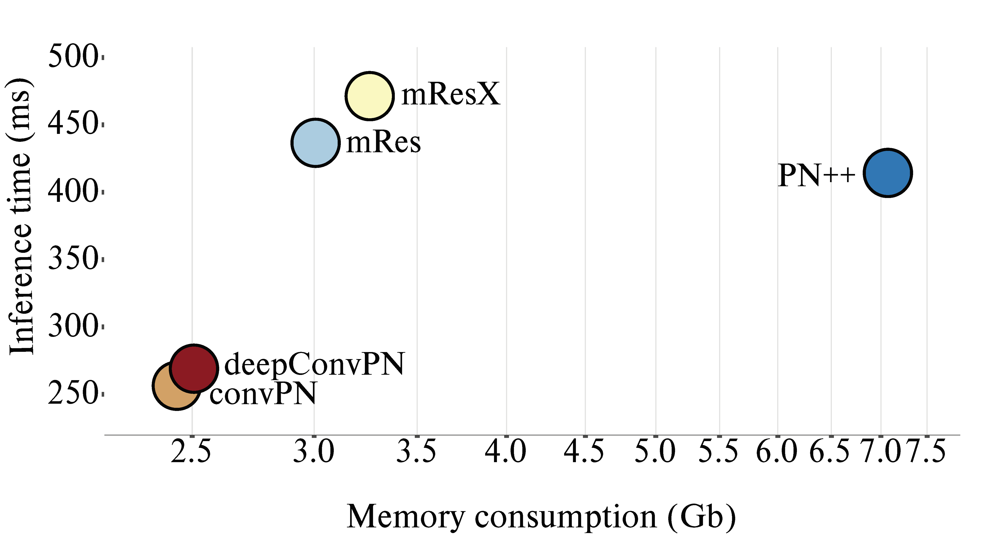
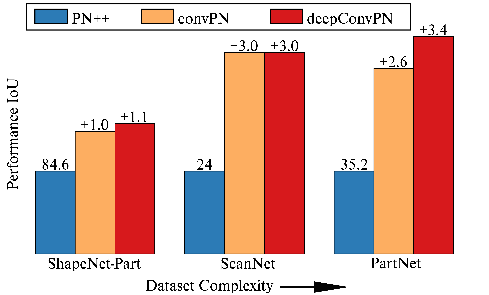
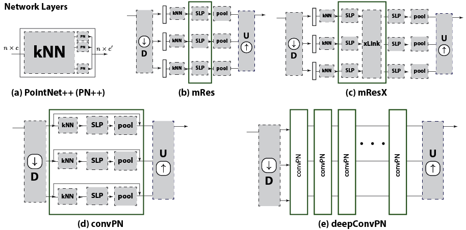

# Going Deeper with Lean Point Networks

In this work, we train deeper and more accurate point processing networks by introducing three modular point processing blocks that improve memory consumption and accuracy: a *convolution-type block* for point sets that blends neighborhood information in a memory-efficient manner; a *crosslink block* that efficiently shares information across low- and high-resolution processing branches; and a *multi-resolution point cloud processing block* for faster diffusion of information. By combining these blocks, we design wider and deeper point-based architectures.

We report systematic accuracy and memory consumption improvements on multiple publicly available segmentation tasks by using our generic modules as drop-in replacements for the blocks of multiple architectures (PointNet++, DGCNN, SpiderNet, PointCNN).

[[Paper]](https://arxiv.org/abs/1907.00960)


<div style="text-align:center">  

## Overview
The standard PN++ layer in (a) amounts to the composition of a neighborhood-based lookup and a PointNet element. In (b) we propose to combine parallel PointNet blocks in a multi-resolution architecture, and in (c) allow information to flow across  branches of different resolutions through a cross-link element.
In (d) we propose to turn the lookup-SLP-pooling cascade into a low-memory counterpart by removing the kNN elements from memory once computed; we also introduce residual links, improving the gradient flow. In (e) we stack the block in (d) to grow in depth and build our deep architecture. Each of these tweaks to the original architecture allows for systematic gains in memory and computational efficiency. The green box indicates that the block can be grown in depth by stacking those green units.

<div style="text-align:center">

Further information and details please contact [Eric-Tuan Lê](mailto:e.le@cs.ucl.ac.uk).

## Creating the environment
With **conda**, you can set up a specific environment to run the scripts within this repository. Just type the following within your terminal:
```
conda create -n deepPN_env
conda activate deepPN_env
pip install torch==1.2.0
pip install tensorboardX
```

## Launching the networks
To launch the training of a specific network, you need to run the script *train_dataset.py* followed by the network name. For example, if you want to run our deepConvPN network with the default parameters, you can run the following command:
```
python train_shapenetpart.py --network deepConvPN --workers 4 --batch_size 32
```
You can change the parameters of the networks either by creating a new config file or by changing the arguments within the command line. All the parameters and their values will be displayed in your terminal when you launch the script. Each of them can be changed within the command box.

To test the network, run the same command with the script *test_dataset.py*:
```
python test_shapenetpart.py --network deepConvPN --workers 4 --batch_size 32
```

## Going Deeper
If you want to go very deep, you can change the parameters when launching our deepConvPN network. You will need to change two sets of parameters:
* **list_dim_channels_encoding**: to specify the kernel size of the additional convolution
* **sequence**: to specify where to position the additional Convolution layers

Both of those arguments are nested lists. The first level corresponds to the 3 encoding macro blocks, the second is the resolution and the third is the lower level that corresponds to the convolution blocks. Not that each resolution should have the same number of convolution block.

## Citation
Please cite our paper if you find anything helpful,
```
@misc{le2019going,
    title={Going Deeper with Point Networks},
    author={Eric-Tuan Le and Iasonas Kokkinos and Niloy J. Mitra},
    year={2019},
    eprint={1907.00960},
    archivePrefix={arXiv},
    primaryClass={cs.CV}
}
```

## License
MIT License

## Acknoledgement
Most of the scripts for data loading and data processing have been inspired from [PointNet++](https://github.com/charlesq34/pointnet2) Github repository (for ShapeNet-Part and ScanNet), [PartNet](https://github.com/daerduocarey/partnet_seg_exps) Github repository (for PartNet) or [DeepGCN](https://github.com/lightaime/deep_gcns) Github repository (for S3DIS).
